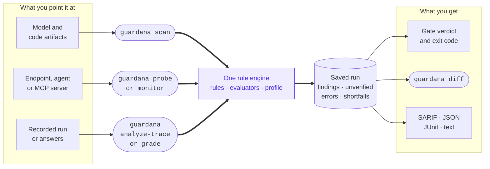

<div align="center">

# 🛡️ Guardana

Guardana is an open-source AI security verification tool for security and platform engineers. It checks code and model artifacts, live AI systems, and recorded runs. It reports what it found, what it could not verify, and what it could not check. It verifies outside the request path; it is not an inline guardrail, a general SAST or CVE scanner, or a compliance certification.

[](https://github.com/guardana/guardana/actions/workflows/ci.yml)
[](https://www.bestpractices.dev/projects/15119)
[](LICENSE)
[](https://www.python.org)
[](docs/product-status.md)
[](#what-it-checks)
[](https://pypi.org/project/guardana-cli/)
[](CONTRIBUTING.md)

[Quickstart](#quickstart) · [Features](FEATURES.md) · [Rule catalog](docs/generated/rule-catalog.md) · [Docs](docs/index.md) · [Status & limits](docs/product-status.md) · [Current work](https://github.com/guardana/guardana/issues) · [Changelog](CHANGELOG.md) · [Get involved](#get-involved)

</div>

---

**58 built-in security checks; add checks for your application.** The count comes from the [generated rule summary](docs/generated/rule-summary.md). Built-in artifact checks need no network. `scan --reporter server://<url>` sends results to a collector; active checks contact the target you choose. Guardana needs no account and has no automatic telemetry or phone-home.

## Quickstart

```bash
uvx --from guardana-cli guardana scan .   # zero-install run (uv)
uv add guardana-cli                       # or: pip install guardana-cli
```

The command is `guardana`; the distribution is `guardana-cli`. An uncached `uvx` run or an install downloads the distribution. For a source checkout, clone and run `uv sync` as described in [`docs/install.md`](docs/install.md).

Start with an offline result:

```bash
guardana init --starter first-run   # a small project with one problem to find and fix
```

Its README walks through a failing scan, the fix, a saved run, and a check of your own. Once Guardana is installed, it needs no account, key, model, or network.

Scan the bundled vulnerable model directory for another example:

```console
$ uv run guardana scan examples/vulnerable-model

✖ [CRITICAL] guardana.supply_chain.pickle_opcode — Dangerous pickle opcode (arbitrary code on load)
    unpickling imports 1 non-allowlisted callable(s) (set 705e9da4c561): posix.system  (examples/vulnerable-model/model.pt)
✖ [HIGH] guardana.supply_chain.dependency_risk — Unsafe model/deserialization loader call
    torch.load without weights_only=True  (examples/vulnerable-model/load_model.py:3)
✖ [CRITICAL] guardana.supply_chain.remote_code_config — Model config requests custom-code execution on load
    '_attn_implementation_internal' names the Hub kernel repository 'attacker/kernel-repo', which transformers downloads and imports on load — a private field, so trust_remote_code=False does not stop it (CVE-2026-4372)  (examples/vulnerable-model/config.json)
…
▲ [MEDIUM] guardana.supply_chain.hallucinated_package — Import of unknown package (possible slopsquat lead)
    import 'torchutilz' isn't a known package or a declared dependency — declare it in requirements/pyproject, or verify it exists on PyPI  (examples/vulnerable-model/train.py:1)
…

12 finding(s); 19 rule(s) run, 0 skipped. 5 component(s) observed.
```

That run exits `1`, so it can gate CI. To check your own work:

```bash
guardana scan path/to/your/project     # static, offline, no model needed
guardana init                          # write a guardana.yaml policy file
guardana scan . --format sarif         # SARIF 2.1.0 for GitHub code scanning

guardana probe --url http://localhost:11434 --model llama3 --preset ci --format json --output run.json
guardana diff accepted-run.json run.json   # 0 nothing worse at the policy's bars · 1 it is · 2 cannot tell
```

Choose a guide for [your own project](docs/recipe-local-scan.md), [a run your application recorded](docs/recipe-recorded-answers.md), or [the application your users talk to](docs/recipe-real-application.md).

Every published distribution has signed, keyless build provenance verifiable with `gh attestation verify`, plus a PEP 740 attestation on PyPI.

## What it checks

The [generated rule summary](docs/generated/rule-summary.md) counts 58 built-in rules: 19 artifact rules and 39 runtime rules. The runtime rules span live endpoints, live MCP servers, live A2A agents, seeded applications, and recorded traces. A single endpoint does not exercise all 39. Rules map to both editions of the OWASP LLM Top 10, the OWASP Top 10 for Agentic Applications, the OWASP MCP Top 10, OWASP ML Top 10, MITRE ATLAS v5.6.0, and NIST AI 100-2e2025. References include their edition.

| Family | Rules | Surface | What it covers |
|---|---|---|---|
| `guardana.supply_chain.*` | 16 | build | unsafe loading, remote code, model formats, dependencies, transport, secrets, and provenance |
| `guardana.prompt.*` | 7 | build + runtime | hidden instructions, tool poisoning, injection, jailbreaks, prompt leakage, and resource consumption |
| `guardana.agent.*` | 7 | runtime | tool-result injection, credential exfiltration, broad arguments, excessive use, memory poisoning, tool schemas, and MCP server manifests |
| `guardana.mcp.*` | 10 | runtime | authentication, discovery, audience, session, scope, issuer, cache handling, task listings, and registry entries |
| `guardana.a2a.*` | 3 | runtime | agent cards, callers without a credential, and one caller's view of another's tasks |
| `guardana.trace.*` | 9 | runtime | recorded credential, identity, consent, policy, approval, retrieval, effect, and handoff boundaries |
| `guardana.scenario.*` | 2 | runtime | multi-turn jailbreak and indirect-injection scenarios |
| `guardana.tenancy.*` | 1 | runtime | another tenant's seeded data reaching a reply, asked through the application's own index |
| `guardana.retrieval.*` | 1 | runtime | an instruction planted in a seeded document being followed |
| `guardana.output.*` | 1 | runtime | secrets in model output |
| `guardana.training.*` | 1 | build | training-data integrity |

The 19 static rules need no model or network. The generated [rule catalog](docs/generated/rule-catalog.md) lists built-in rule ids, severities, surfaces, and framework mappings. `guardana rules` shows rules admitted in the current installation, including trusted third-party rules. See [`FEATURES.md`](FEATURES.md) for the capability overview and the [generated detection limits](docs/generated/detection-limits.md) for what each finding establishes.

## How results gate a run

Guardana keeps four outcomes separate:

- `findings`: a check reached a negative verdict;
- `unverified`: it ran but could not decide;
- `errors`: it could not run;
- coverage shortfalls: required evidence was unavailable, or the scan observed a model file that no running rule examined.

Results that require judgment include an outcome, confidence, rationale, and evaluator identity. `guardana calibrate` measures evaluator confidence against labelled samples. An exhausted budget exits `6` and preserves its results. A comparison that cannot be made exits `2`. Missing evidence is not reported as success.

## Use it in CI and your application

Guardana verifies artifacts, deployed systems, and recorded evidence:

| Verb | Command | What it does |
|---|---|---|
| **Verify artifacts** | [`guardana scan <path>`](docs/usage-scan.md) | Static checks for code and model artifacts; offline without a reporter. |
| **Verify a deployed system** | [`guardana probe --url … --model …`](docs/usage-probe.md) | Active checks against a model, agent, or MCP server. |
| **Verify a recorded run** | [`guardana analyze-trace trace.jsonl`](docs/usage-analyze-trace.md) | Checks a recorded execution, as OpenTelemetry GenAI spans or Guardana's native trace format, against built-ins and your [security contract](docs/usage-contracts.md); offline without a reporter. |
| **Grade recorded answers** | [`guardana grade answers.jsonl`](docs/usage-grade.md) | Grades answers your application already gave, or a probe kept with `--keep-exchanges`, with your rules; sends nothing to the target. |
| **Inspect available evidence** | [`guardana trace inspect trace.jsonl`](docs/usage-trace-inspect.md) | Shows recorded evidence dimensions and policy gaps. |
| **Continuously re-verify** | [`guardana monitor --url … --model …`](docs/usage-monitor.md) | Re-runs active checks on a schedule and compares each cycle with the first cycle, not an accepted saved-run baseline. |
| **Compare evidence** | [`guardana diff a.json b.json`](docs/usage-diff.md) | Reports whether the later saved run is worse, or refuses an invalid comparison. |
| **Import external observations** | [`guardana import-observations results.json`](docs/usage-import-observations.md) | Imports garak, promptfoo, or custom results as `unverified`, with provenance. It never exits `0` because Guardana verified nothing. |

`scan`, `probe`, `monitor`, and `analyze-trace` can send findings to an optional collector with `--reporter server://<url>`. Other commands cover planning, capability inspection, configuration, baselines, run inspection, rule testing, and extension packs. See [`docs/index.md`](docs/index.md). Exit codes have eight documented meanings, tested against [`docs/exit-codes.md`](docs/exit-codes.md); CI does not need to parse console text.

### GitHub Actions

```yaml
# .github/workflows/ai-security.yml
name: AI security
on: [push, pull_request]
jobs:
  guardana:
    runs-on: ubuntu-latest
    permissions:
      contents: read
      security-events: write   # to upload SARIF
    steps:
      - uses: actions/checkout@v7
      - uses: guardana/guardana@v0.41   # moving tag → latest 0.41.x
        # with:
        #   args: --preset ci --baseline guardana-baseline.yaml
```

Both `actions/checkout@v7` and `guardana/guardana@v0.41` are moving tags. Replace them with full commit SHAs if your workflow requires pinned actions. The published Guardana Action pins the actions it calls by SHA; that does not pin these two references in your workflow. A pre-commit hook and templates for GitLab, Jenkins, and Azure DevOps are in [`docs/integrations.md`](docs/integrations.md).

### Tests and Python

The same rules, policy, redaction, and gate work in tests ([`docs/usage-testing.md`](docs/usage-testing.md)):

```python
from guardana.adapters.langchain import langchain_target
from guardana.testing import assert_secure


def test_the_repository_ships_no_dangerous_artifact():
    assert_secure("models", preset="ci")


def test_the_agent_keeps_its_instructions_to_itself(chat_model):
    assert_secure(langchain_target(chat_model, system_prompt=SYSTEM), preset="ci")
```

To read a run as data instead of asserting on it, the supported [`guardana.core.verify`](docs/python-api.md) API returns what `scan` and `probe` write, including failed and budget-stopped outcomes. Python callers must state plugin trust. Quality suites gate answer quality on team-supplied versioned datasets; see the [quality-suite guide](docs/usage-suites.md).

### Before active testing

Probes send real requests and can cost money or trigger provider abuse detection. The default profile sets no request or cost ceiling. Set a budget before using a paid target, and prefer staging. Guardana sends tool calls to doubles, but the surrounding application can still act on a model response. Evidence may contain sensitive text and is redacted by default. `guardana monitor` re-runs active probes on a schedule. See [`docs/safe-testing.md`](docs/safe-testing.md), [`docs/privacy.md`](docs/privacy.md), and [`docs/profiles.md`](docs/profiles.md).

For example, put this budget in `guardana.yaml`:

```yaml
budgets: {max_requests: 60, max_duration: 5m}
```

Plan first, then probe a staging URL:

```bash
guardana plan probe --url https://staging.example/v1 --model support-bot --profile guardana.yaml
guardana probe --url https://staging.example/v1 --model support-bot --profile guardana.yaml
```

Against a staging endpoint that refused every prompt, the result was `indeterminate` (exit `2`):

```text
⚠ No findings, but 4 piece(s) of coverage were missing (this is not an all-clear).
0 finding(s); 14 rule(s) run, 16 skipped. 4 unverified. 4 piece(s) of coverage missing. 24/28 case(s) measured, 4 ungraded. 1 component(s) observed.
```

The missing coverage includes a check whose payload was never delivered. Zero findings here is not a pass.

### What Guardana observes in three systems



| System | Point Guardana at | What it observes | What it cannot see |
|---|---|---|---|
| A dedicated model | Model files with `guardana scan PATH`; a staging endpoint with `guardana probe`. | File risks and replies to selected active checks. | What an application does after receiving a model reply. |
| A multi-tenant retrieval application | Its endpoint with `--fixtures`; recorded answers with `guardana grade RECORDING`. | Tenant-boundary markers and poisoned-document instructions that reach replies. | Internal retrieval that never appears in a reply, or production traffic. |
| An agent with tools | Its endpoint, an MCP server or A2A agent; recorded traces with `guardana analyze-trace TRACE`. | Selected probe replies, protocol surfaces and recorded tool effects; tool doubles can supply test tools. | Calls and effects absent from the recorded trace, or production traffic. |

## Extend it for your application

The 58 built-ins cover shared risks. Installed packages have six entry-point groups: **rules, evaluators, targets, taxonomies, renderers, and reporters**. Rules express checks in YAML or Python; evaluators grade replies (configuration supports `llm_judge` through an OpenAI-compatible endpoint and the optional `guard` classifier); targets connect through locator schemes; taxonomies add control sets; renderers add formats; reporters add destinations. See [`docs/writing-rules.md`](docs/writing-rules.md), [`docs/outputs.md`](docs/outputs.md), and [`docs/extending.md`](docs/extending.md).

A profile (`guardana.yaml`) configures a run. A finding is a result format. A [security contract](docs/usage-contracts.md) declares policy for one application. None is an entry-point group.

One pack flow is: install `guardana-reference-pack` 0.1.0 from the GitHub Release; admit its distribution with `--plugins allowlist --allow-plugin` or `plugins:`; select its rules in `guardana.yaml`; run `guardana probe`. [`examples/reference_pack`](examples/reference_pack) includes sampled rules, a target, an evaluator, a taxonomy, a renderer and a reporter. The [conformance kit](docs/conformance-kit.md) checks that an extension keeps its contract.

By default, Guardana loads only its own distributions. It refuses an installed third-party pack before importing it and records the refusal as an error. Under the default gate, a run with a refused pack is `indeterminate`, even if that run did not select its rules. `guardana doctor` shows what would load. Admitted Python packs run with your privileges; see [`SECURITY.md`](SECURITY.md).

[`examples/custom_rule/`](examples/custom_rule/) is a working third-party package. `guardana new-rule` scaffolds a rule. The `guardana-core` library supports embedding the engine without the CLI. See [`docs/architecture.md`](docs/architecture.md) and [`docs/product-status.md`](docs/product-status.md). The compatibility policy is in [`docs/compatibility.md`](docs/compatibility.md).

## Maturity and limits

The engine, built-in rules, CLI workflows, supported Python verification API, extension API, quality suites, and optional collector are beta. The extension API is frozen at 1.0 under [`docs/compatibility.md`](docs/compatibility.md). Read [`docs/product-status.md`](docs/product-status.md) before using Guardana as a security gate.

Guardana's agent harness tests a model with Guardana's scripted tools; it does not exercise your agent's own framework and tools. Trace analysis checks an execution your application recorded. `monitor` samples by running active checks; it does not inspect production traffic. A scan of a path with no file to read is indeterminate rather than a pass, but a scan cannot tell whether the files it read are the ones you meant to ship; a release preset needs rules selected for the target's capabilities. The current checks cover text, not image, PDF, audio, or document carriers. Provider compatibility and judge-graded verdicts need validation for your deployment.

### Where Guardana fits

| Category | Examples | Guardana's relationship |
|---|---|---|
| **Model and artifact scanners** | ModelScan, picklescan | Overlaps at the static layer and covers additional AI artifact formats. |
| **Red-team harnesses** | garak, PyRIT, promptfoo, DeepTeam | Complements their attack libraries. Guardana separates findings, inconclusive results, errors, and missing coverage, and can import their observations. |
| **Evaluation frameworks** | DeepEval, Ragas | Guardana also gates answer quality on team-supplied datasets through suites. Use it alongside DeepEval or Ragas. |
| **Runtime guardrails** | LlamaFirewall, Llama Guard | Verifies and gates; it does not run inline. |
| **AI observability** | LangSmith, Langfuse | Uses OpenTelemetry output as trace-analysis input. |
| **SAST, CVE, and secret scanners** | Semgrep, Trivy, gitleaks | Adds AI-specific verification beside general application security tools. |

A run records what was checked, what could not be checked, and the sample used. This distinguishes fewer findings from less coverage and prevents an invalid comparison from appearing as no change.

## Central monitoring — self-hosted

The collector is optional. Local and CI verification do not depend on it. For shared visibility, runs can send normalized findings to self-hosted `guardana-server`, backed by PostgreSQL with an opt-in dashboard. The collector's [HTTP API](docs/usage-collector.md#the-http-api) stores and serves results and does not start scans or probes. `/openapi.json` describes its routes, `ingest` and `read` key permissions, and refusals.

> **Maturity: beta.** Finding routes require scoped API keys. Projects cannot read each other's data, and keys can be pinned to an environment. Findings have audited lifecycle states and expiring waivers. Operators control retention and deletion. The dashboard uses a read-scoped session; it has no human identities or RBAC.
> [`docs/usage-collector.md`](docs/usage-collector.md) · [`docs/deployment.md`](docs/deployment.md)

The engine and built-in rules are Apache-2.0. See the project [principles](CONTRIBUTING.md#principles) and [current work](https://github.com/guardana/guardana/issues).

## Documentation

- [`docs/index.md`](docs/index.md) — documentation map
- [`docs/product-status.md`](docs/product-status.md) — maturity and known limits
- [`docs/how-it-works.md`](docs/how-it-works.md) — product overview
- [`docs/install.md`](docs/install.md) · [`docs/usage-init.md`](docs/usage-init.md) · [`docs/profiles.md`](docs/profiles.md) · [`docs/exit-codes.md`](docs/exit-codes.md)
- [`docs/usage-suites.md`](docs/usage-suites.md) · [`docs/python-api.md`](docs/python-api.md) — quality suites and supported Python API
- [`docs/threat-model.md`](docs/threat-model.md) · [`docs/privacy.md`](docs/privacy.md) · [`docs/safe-testing.md`](docs/safe-testing.md)
- [Current work](https://github.com/guardana/guardana/issues) · [Release milestones](https://github.com/guardana/guardana/milestones) · [`CHANGELOG.md`](CHANGELOG.md)

## Security

Report suspected vulnerabilities privately through [`SECURITY.md`](SECURITY.md), never public issues. Review third-party Python packs before admitting them; the security policy explains plugin trust and supported versions.

## Related project: Guardana Control

[Guardana Control](https://github.com/guardana/control) is a separate, independent open-source project. It sits in the request path of an AI agent's MCP tool calls: it decides each call, enforces the decision, and records evidence. It is alpha; its own README says not to deploy it as a security boundary. Guardana verifies from outside any request path, before and between releases. Neither project needs the other.

## Get involved

- Try it in about ten minutes and tell us where you got stuck in a [first-run session](docs/studies/first-run-study.md).
- Bring your team's LLM, RAG or MCP application as a [pilot](docs/studies/adopter-study.md). Start in [GitHub Discussions](https://github.com/guardana/guardana/discussions) or email contact@guardana.dev.
- Write your own pack or check. See [docs/extending.md](docs/extending.md) and [examples/](examples/).
- Star the repository or watch releases if you want to follow 1.0.

See [CONTRIBUTING.md](CONTRIBUTING.md). New rules need a framework mapping and fixtures.

**contact@guardana.dev** · [karauda.com/contact](https://karauda.com/contact) · [guardana.dev](https://guardana.dev) · [github.com/guardana](https://github.com/guardana)

## License

Apache License 2.0 — see [`LICENSE`](LICENSE). Use it, ship it, build on it.

<div align="center">
<sub>Built to guard the AI you run yourself.</sub>
</div>
