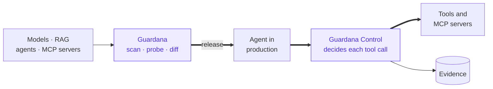

# Product status and known limitations

What is ready, what is not, and what Guardana deliberately does not do. Read this
before adopting it for anything that matters.

A security tool that overstates its own readiness has already failed at its job,
so this page is maintained as carefully as the code.

## Maturity by component

| Component | Maturity | What that means in practice |
|---|---|---|
| Engine + built-in rules | **beta** | Stable enough to gate a build on. Outside `guardana.core.verify`, the Python API still moves between minor releases. |
| Python API (`guardana.core.verify`) | **beta** | Runs what `guardana scan` and `guardana probe` run and returns every outcome as typed data, failed and stopped runs included. Its supported surface is `guardana.core.verify.__all__`; a change to it is announced as breaking with what to write instead. Trace analysis, `monitor` and baselines run from the command line only. |
| `guardana scan` | **beta** | Deterministic, offline, no false-positive theatre. The most mature part of the product. |
| `guardana probe` | **beta** | Works against OpenAI-compatible, Ollama, TGI, guarded endpoints, live MCP servers — on both their tool manifest and their authorization surface, and never by calling a tool — and A2A v1 agents, on their card and whom they answer, with reads only. Verdict quality depends on the evaluator you configure. |
| `guardana monitor` | **beta** | Scheduled **active** verification. Not passive traffic inspection, not inline. |
| `guardana diff` | **beta** | Compares two saved runs. The saved-run format is versioned and migratable — `guardana run migrate` reads every earlier schema. |
| Collector (`guardana-server`) | **beta** | PostgreSQL with reversible migrations, a scoped API key on every route carrying a finding, project isolation on every query, and a record of what each run verified and where. Findings have a lifecycle and expiring waivers; actions are audited; retention and deletion are commands. What it does not yet hold is a quality trend — it aggregates findings, not measurements. |
| `guardana grade` | **beta** | Grades a recording — answers you supplied, or the exchanges `probe --keep-exchanges` kept — with your rules and no target request. MCP and A2A rules are `not_applicable` on a chat recording; canary and tool rules still skip for a missing capability, and a rule the recording does not answer is skipped as `not_recorded`. |
| Quality suites | **beta** | Gates pass rates on team-supplied versioned datasets, with repeated trials and judge correction. No numeric aggregate gate or statistical comparison between suite runs. |
| Extension API | **beta** | Frozen at 1.0 under the [compatibility policy](compatibility.md). The remaining 1.0 criteria are below. |

## Released and experimental

**Released (beta):** Quality suites use the deterministic assessors `exact_match`, `contains`, `regex`, `json_valid`, and `length`. They support versioned JSONL datasets (`name@version`), deterministic sampling (`sample: {size, seed}`), repeated trials per case, and a suite gate that passes, fails, or declines with `min_sample`. Runs save a suite summary in the run document and show a Measured block in the human report. JUnit output is available.

**Experimental:** Judge-graded suites use `answered` and `reference_judge`. Judge-error correction adjusts trial and suite rates using Rogan–Gladen and a calibration recorded on the team's own corpus with `guardana calibrate --record`. Without a usable calibration, the suite declines; it never passes on an uncorrected judge rate. Experimental behaviour and thresholds are outside the compatibility promise, but saved documents remain versioned and readers continue to support older versions under the persisted-document policy.

**Released (beta), first half of F6:** [repository recipes](usage-recipe.md) that pin a team's checks and refuse a run whose pins moved, one set of connection settings across `probe`, `plan probe`, `target inspect`, `monitor` and every judge, and a tested [provider table](providers.md).

**Released (beta), F7:** MCP checks proven against servers built on the `mcp` SDK in both revisions, and the A2A checks against agents built on `a2a-sdk`; a capability a server does not offer is recorded as skipped `not_offered`, a coverage gap.

**Released (beta), F4:** an installed package adds a format for `--format` and a reporter for `--reporter` ([installed outputs](outputs.md)), imported only when named, behind the redaction the saved run went through, with a delivery line on every path and exit `8` when an installed output fails. `examples/output_pack` is the reference: a CSV export and a Standard Webhooks sender. It is an example to copy, not a published package, and the output contract is versioned by its own `output_api`. Not supported: diff renderers, binary formats, more than one reporter per run, and installed outputs on `monitor`, `import-observations` and `recipe run`.

**Not released:** The five-user first-run study (F2) and the rest of F6 (the team regression loop and the live retrieval pilot) remain [1.0 criteria](#before-the-first-stable-release).

## Before the first stable release

At 1.0, the supported Python facade, rule, evaluator and target contracts,
output contracts, CLI flags and exit codes, profile schema and collector
envelope become a compatibility promise.
[Compatibility](compatibility.md) defines the full surface.

1.0.0rc1 shipped the 0.41.0 supported surface unchanged. That surface is frozen
until stable 1.0. Candidates carry fixes only, with no new CLI flag, persisted
field, rule family or public API. A change to the existing supported surface
is allowed only to correct a defect in it and must be announced.

Three candidates are required: rc1, rc2 and rc3. The rc3 round lets fixes found
after the first external reports land before the stable promise. Both `1.0.0rc2`
and `1.0.0rc3` ship only after their own full green release gate and green CI on
the exact commit. A further candidate is required only if a release blocker
needs one.

Stable 1.0 does not follow rc3 automatically. A candidate must have a period
without new defect reports, and the following criteria must hold:

- Five consented first-run sessions with people new to Guardana. Target: at
  least four of five people complete a failure, a fix and one custom check in
  ten minutes without maintainer help. The clean-install starter provides
  saved evidence without an account, key, model or collector. It uses built-in
  trust and explains what an installed pack would execute. Separate paths
  cover local scans, recorded answers and a real application.
- Two independent teams run locked checks against their own application.
  Recipes pin profiles, datasets, packs and grading identities. Each team
  saves a failed and an incomplete result, versions and regrades a redacted
  regression, and gates it in CI with a reviewable artifact. Use safe fixtures
  or doubles. Label any model harness clearly. Sensitive production data is
  never promoted automatically.
- One controlled live retrieval pilot on a team's own retrieval target catches
  a poisoned document and a tenant-filter failure without an uncontrolled
  side effect.
- One successful third-party customization and an independent reproduction
  are recorded with consent. Third-party targets, rules, evaluators, formats
  and reporters work without an engine fork.
- Python consumers receive failed, incomplete and stopped outcomes as typed
  data. Case outcomes and missing evidence survive serialization, redaction
  and export.
- First-run completion, real-application coverage and the share of attempted
  checks reaching a supported verdict with comparable evidence are published
  from generated data. Research is recorded with consent, without telemetry
  or invented adoption claims.
- The supported surface, compatibility matrix and deprecation policy are
  published. The conformance kit is published. A reference pack is
  independently installable from PyPI, with an independent installation
  exercised.
- Every built-in rule that can decline has finding, clean and inconclusive
  fixtures.
- Provider and adapter conformance covers the pilots' system messages, tools,
  failure paths, budgets, usage and adapter limits.
- The collector envelope is versioned independently from the run schema.
  Clients and storage migrate together.
- Older persisted documents and extension conformance pass the release gate.
  Migrations are exercised with older run, dataset, profile, pack and collector
  documents.
- The security runbook is exercised in a drill. Recovery runbooks are exercised.

Today the generated [first-run measure](generated/first-run.md) and
[application measures](generated/application-measures.md) read "not measured":
0 of 5 sessions and 0 of 2 teams. The reference pack is attached to the GitHub
Release but is not on PyPI. Recovery runbooks are exercised by tests, and the
security drill is not recorded. These facts do not substitute for the remaining
external evidence.

[Issues](https://github.com/guardana/guardana/issues) are the live work queue.
The [milestones](https://github.com/guardana/guardana/milestones) `1.0.0rc2`,
`1.0.0rc3` and `1.0.0` group release scope, not dates. The target remains the
first quarter of 2027, set by external evidence rather than by the code. A
missed criterion moves the stable release, not the criterion. The owner decides
changes to release criteria.

Paired statistical diff (M1) starts when two independent pilot teams use local
`diff` on comparable saved before/after application runs for a documented ship
decision, and one needs uncertainty beyond descriptive counts. Collector
measurements (M3) start when two independent teams submit and read their own
locked application runs in the optional collector and each asks the same
cross-run question local files cannot answer. The [roadmap](../ROADMAP.md)
preserves their full done conditions. Neither these items nor the Later
possibilities block 1.0.

## Product boundaries for future proposals

The roadmap's eight [product constraints](../ROADMAP.md#product-constraints)
govern proposals as well as releases.

Ideas without a reproducible problem or acceptance test start in
[Discussions Ideas](https://github.com/guardana/guardana/discussions/categories/ideas).
Promotion to active work requires pilot pain, a reproducible failing case,
an acceptance criterion and a review of the versioned contract it touches.
The [contribution principles](../CONTRIBUTING.md#principles) and
[threat model](threat-model.md) explain these boundaries in more detail.

## Known limitations

Stated plainly, because finding these out after adoption is worse than reading
them now.

### The agent harness is ours, not yours

Trajectory rules measure a model's agentic judgement by playing the harness around
it: Guardana offers the tools, hands back the results, and never executes
anything. That is a genuine test of the model's judgement — and it is **not** a
test of *your* agent, with your framework, your prompts and your tool
implementations.

`guardana analyze-trace` grades a recorded trace exported from a running agent.

### Recorded answers are matched exactly, and only chat is recorded

`guardana grade` answers a rule's question from a recording only when the recording holds
exactly the messages the rule sends; whitespace or a reworded question is an unanswered
question, which errors rather than passes. A probe keeps the chat exchanges of its plain pass
and nothing else, so canary passes and tool offers cannot be graded again, while MCP and A2A rules are `not_applicable` on the chat recording. A
pack's own endpoint target cannot keep exchanges. A reply redaction changed is never graded
again. `grade` sends nothing to the collector.

### A release gate cannot see a target that holds the wrong files

`--preset release` fails when a selected check has a coverage gap or reaches no verdict. MCP and A2A rules on a chat endpoint are `not_applicable`, not coverage gaps; a chat rule missing tools or seeded fixtures can still leave `probe --preset release` `indeterminate`. A rule demanded by id remains a `demanded_check` shortfall even when its protocol is inapplicable. A profile can select rules the endpoint serves ([profiles](profiles.md#release-complete-coverage-or-no-pass)). A `scan` of a path that holds no file other than `.guardanaignore` files is `indeterminate` (exit `2`) under every preset, and `plan scan` refuses it. A scan cannot tell a directory holding the wrong files from the one the build meant to produce.

### Protocol coverage is narrow on purpose

MCP is spoken in `2026-07-28` and `2025-11-25`; a server answering in an older revision is
reported as sharing no revision, never graded in one Guardana does not speak. Task ids are
graded only as a caller without a credential sees them, because creating a task would take
a `tools/call` or a `SendMessage` on somebody's system. A registry entry is the file you
supply, never fetched, and what a server reports about its version is its own claim; Server
Cards (`.well-known/mcp.json`) are not read. An A2A agent is spoken to over the JSON-RPC
binding of version `1.0` only, on the origin you named: HTTP+JSON, gRPC and an interface
on another origin are not examined, and agent-card signatures are not verified.

### `monitor` is scheduled, not passive

It re-runs checks on an interval. It does not observe production traffic, cannot
see what your real users are doing, and is not an inline control. Watching live
agent traffic is not planned here: it belongs to Guardana Control, a separate
project.

### The collector stores and triages findings — it does not trend quality

It persists, authenticates, and isolates one project from another — and one
environment from another when a key is created with `--environment`. Everything
that happens *after* a finding arrives is there too: a lifecycle (open,
acknowledged, resolved, and back to open when the finding recurs), waivers whose
expiry is evaluated at read time, an audit log that records whether the actor was
a verified key or an unverified CLI claim, retention and deletion as commands, and
a restore-tested backup procedure. The dashboard signs in with a read-scoped key
held in an `HttpOnly`, `SameSite=Strict` cookie.

What it does **not** hold is a measurement trend. The generated application coverage and supported-verdict share remain "not measured" until two independent teams have rows in [`docs/generated/application-measures.md`](generated/application-measures.md). It aggregates findings,
`unverified` and errors — so it can answer "is this system accumulating security
problems", and cannot yet answer "did quality improve". Assessments are recorded in
the run document from 0.22.0; carrying them into the collector, with the sample
sizes and confidence bounds a trend needs to be honest, is the next horizon.

### RAG coverage is a slice, not a story

`scenario.indirect_injection` tests the shape of retrieval-time injection through
a scripted context. `guardana.trace.cross_tenant_retrieval` grades cross-tenant
retrieval from a recorded trace. With [`--fixtures`](usage-fixtures.md),
`guardana.tenancy.cross_tenant_answer` and `guardana.retrieval.poisoned_document` ask
through the application's own index as each tenant; they see what reached a reply, not
what was retrieved, and Guardana never queries a vector store itself.

Both checks are verified against a reference application,
[`examples/retrieval_pilot/`](../examples/retrieval_pilot/), whose tests run them with a
broken tenant filter, an obeying model, a partly seeded index and the fixed application
on every CI run. It is a reference, not a team's own retrieval target: until one has run
them, the retrieval pilot remains an [open 1.0 criterion](#before-the-first-stable-release).

### Text only

No image, PDF, audio or document carriers. Injection through an image or a PDF an
agent reads is a real attack class and is **not covered**. A proposal for a
multimodal carrier needs a pilot's concrete input, expected result and bound
before it becomes an implementation issue.

### "OpenAI-compatible" is not a guarantee

Providers differ in system-message handling, tool-call formats, streaming, finish
reasons and usage metadata. A rule that needs a capability a provider does not
support is skipped and reported as skipped — never as a pass, and `guardana target`
tells you which capabilities an endpoint answered for *before* you trust a run
against it.

The [provider table](providers.md) is tested: one suite holds every built-in transport, the
adapter and LangChain to it against a local double that speaks each wire shape and fails on
cue. It describes Guardana's transports, not the servers behind them: whether vLLM, Ollama,
SGLang, llama.cpp and TGI agree on streaming, finish reasons or usage metadata is still a
claim to check per deployment, not a guarantee.

### A recipe records what you declare about the subject

`subject.kind` says whether an application or a model harness answered, and Guardana
records it in every output without being able to check it: a URL does not say what is
behind it. Guardana neither starts nor verifies the fixtures or test doubles your
application runs with in CI; a recording subject is the one way a recipe runs with no live
call at all. A check from a distribution installed from a directory or a URL is listed as
unpinned, because its code can change under one version.

### Probabilistic verdicts have probabilistic limits

A judge-graded verdict is a measurement with error. `guardana calibrate` reports
Brier score and expected calibration error so you can see how much to trust it,
and a policy can gate on confidence. It also reports per-class `sensitivity` and
`specificity`. A class with fewer than 30 graded samples or abstentions on at
least half its samples gets a `RATE CAVEAT:` line. A qualifying calibration
corrects a trials rate with the Rogan–Gladen method. When a condition is not met,
such as fewer than 30 graded samples in a class or use of the starter corpus, the
line states `uncorrected — judge error not measured` and names the reason. A
recorded calibration can go stale without anything noticing — re-measure after
changing judge models.

### Plugins are code you install

Entry-point discovery imports installed packages. A malicious Guardana pack is a
malicious Python package, with everything that implies. Every command therefore starts
with `--plugins builtins`: Guardana's own distributions load, every other installed pack
is refused before it is imported, and the refusal is recorded so the run says what it
declined. A pack is admitted by name (`--plugins allowlist --allow-plugin`, or
`plugins:` in a profile), `guardana doctor` lists what it would execute, and a locked
pack (`guardana pack lock`) pins the digest of every rule it provides. A lock pins an evaluator or target only when that pack's own distribution registers it; `pack lock --check` reports another distribution's registration as `removed` with exit `1`. `--no-plugins` is
a deprecated alias for `--plugins disabled`, understood only by `scan` and `plan scan`.
Two limits remain: an admitted pack runs with your privileges, and a declarative pack
format that executes no Python is decided but not built. See the [threat
model](threat-model.md).

### Quality suites

Numeric values are recorded and rendered, but suites do not gate on their aggregate.
The collector receives the target's request count, not what the judge spent; the saved run carries both.
`guardana diff` pairs suite cases but does not statistically test the pass rate between runs.
A calibration file holds one calibration per evaluator id.

### Cost is bounded, not predicted

`guardana plan` prices a run before it sends anything, and
`--max-requests`, `--max-input-tokens`, `--max-output-tokens` and `--max-duration` are
hard ceilings that stop the run with exit `6` and an `indeterminate` gate rather than
letting it report partial coverage as a pass. What a plan cannot do is predict a *reply's* token count, so a cost estimate
is a bound on requests and a projection on tokens — a rule with unknown cost is
counted as unknown and says so.

## What Guardana deliberately does not do

- **Inline blocking.** It verifies and gates; it is never in the request path.
- **General code security.** SAST, generic secrets and CVE scanning are well served
  elsewhere.
- **Compliance certification.** The engine reports what it observed; mapping to a
  framework belongs in an extension, because frameworks change dates and wording
  and the engine must not age with someone else's calendar.
- **Attack volume for its own sake.** Other tools send more attacks. Guardana's job
  is knowing which ones worked.
- **Autonomous attacks against production.** Every active check is something you
  asked for, bounded by a policy you wrote.

## How to read a Guardana result

Four channels, because "nothing to report" has four meanings:

| Channel | Meaning | What to do |
|---|---|---|
| `findings` | A check ran and found something | Fix it, or waive it with a reason |
| `unverified` | A check ran and honestly could not reach a verdict | Investigate why — an empty reply, a judge reply that could not be read, a capability gap |
| `errors` | A check **never ran** | Treat as a broken gate, not as a clean result |
| `coverage shortfall` | Coverage the run needed was missing: evidence you **demanded** (a dimension your policy requires, or one your security contract needs), a model file the scan observed that no running rule read, a model or notebook a rule could not read, a target that held no file, or a rule that graded none of its cases (or fewer than `fail_on.min_graded_share`) | Instrument the producer, stop demanding it, run the rule that reads the file or exclude it, check the scanned path, or find out why the cases went ungraded. No `fail_on_*` setting makes this a pass |

A run that reports zero findings and three errors has not told you the system is
clean. It has told you it could not look.

## Where to go next

- [Current work](https://github.com/guardana/guardana/issues) — issues, ownership and release scope
- [Threat model](threat-model.md) — what Guardana defends against and what it does not
- [Safe testing](safe-testing.md) — before you point it at anything that matters
- [Features](../FEATURES.md) — everything that ships today
